<div align="center">

# BHOOMI RAKSHA

### Geospatial Decision Intelligence for Hazard-Based Red Zones & Relocation Planning

**Kangra district pilot · Landslide hazard · SIH 2026**

[](#tech-stack)
[](#tech-stack)
[](#tech-stack)
[](#tech-stack)
[](#tech-stack)
[](#tech-stack)
[](#tech-stack)
<br>
[](#tech-stack)
[](#tech-stack)
[](#tech-stack)
[](#constraint-based-relocation-optimization)
[](#tech-stack)
[](#tech-stack)
[](#tech-stack)
[](#tech-stack)
[](#validation--engineering-quality)

</div>

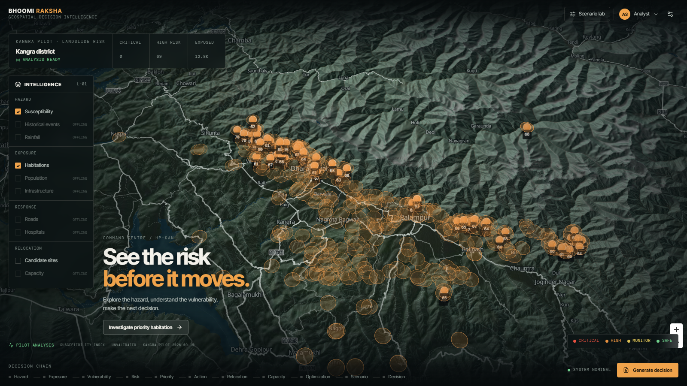

**Bhoomi Raksha is an explainable geospatial decision-intelligence system for disaster risk reduction.** It connects hazard susceptibility, population exposure, vulnerability, habitation-level risk, relocation site screening, carrying capacity, constrained optimization and scenario stress testing into one auditable workflow — so a planner can move from *"where is the hazard?"* to *"what should we do about the people exposed to it?"*

The current build is a deep vertical slice: **one district (Kangra, Himachal Pradesh), one hazard (landslide)**, computed from open elevation, rainfall, population and OpenStreetMap data on a 30 m analysis grid of 6.3 million cells. Every number in the interface is served by a FastAPI decision layer and is traceable to a processed dataset and a documented formula.

**Intended users:** District Disaster Management Authorities (DDMA) — with State Disaster Management Authorities, district administration and disaster planning teams as secondary audiences.

> **Decision support, not an autonomous decision.** The landslide risk index is a composite 0–100 decision-support index — **not a probability, a forecast or a prediction**. The susceptibility model is unvalidated because no landslide inventory for Kangra was obtainable. Read [Limitations & Responsible Use](#limitations--responsible-use) before quoting any number.

---

## Contents

[The Decision Problem](#the-decision-problem) · [What It Does](#what-bhoomi-raksha-does) · [Pipeline](#decision-intelligence-pipeline) · [Walkthrough](#product-walkthrough) · [Architecture](#technical-architecture) · [Geospatial Pipeline](#geospatial-intelligence-pipeline) · [Risk](#explainable-risk-intelligence) · [Decision Trace](#example-decision-trace--kharandar) · [Site Discovery](#relocation-site-discovery) · [Capacity](#carrying-capacity-assessment) · [Optimization](#constraint-based-relocation-optimization) · [Scenario Lab](#scenario-lab--stress-test-the-decision) · [Data](#data--provenance) · [Validation](#validation--engineering-quality) · [Limitations](#limitations--responsible-use) · [Scalability](#scalability--multi-hazard-architecture) · [Demo Flow](#recommended-demo-flow) · [Getting Started](#getting-started) · [API](#api-reference)

---

## The Decision Problem

Disaster management authorities are rarely short of hazard maps. What they lack is the **downstream decision layer** between a hazard layer and an operational plan. Once a district knows where the unstable terrain is, the hard questions begin:

1. **Which habitation needs attention first?**
2. **How many people are actually exposed** — not near the hazard, but in it?
3. **Should relocation be considered** at all?
4. **Where could they move** that is not itself hazardous?
5. **Can the destination support them** — land, water, healthcare, access?
6. **How should people be allocated** across several destinations with finite capacity?
7. **What happens if conditions deteriorate** — heavier monsoon, damaged roads, growing population?

Each of those questions usually lives in a different spreadsheet, GIS project or department. Bhoomi Raksha answers them in one connected chain, where the output of each stage is the input of the next.

> *Others can tell you where the hazard is. Bhoomi Raksha helps determine what to do about the people exposed to it.*

---

## What Bhoomi Raksha Does

| Capability | Decision question | System output (Kangra pilot) |
|---|---|---|
| **Hazard intelligence** | Where is the hazardous terrain? | 30 m landslide susceptibility surface (0–100), 5 classes, **867 red-zone polygons covering 881 km²** |
| **Exposure intelligence** | Who is in it? | Per-settlement exposed population and exposed area for **1,183 OSM settlements** |
| **Risk intelligence** | Which habitations require attention? | Composite landslide risk index, risk class and a transparent weighted contribution per settlement |
| **Priority** | Where should the authority act first? | Priority ranking that balances risk, exposed population and response difficulty |
| **Relocation intelligence** | Where could people move? | **405 screened candidate areas** — 342 FEASIBLE, 63 REVIEW |
| **Capacity intelligence** | Can the destination support them? | Effective and available capacity with the **binding constraint** named |
| **Optimization** | How should people be allocated? | OR-Tools mixed-integer allocation with solver status, assignments and unallocated demand |
| **Scenario Lab** | What if conditions change? | Re-computed susceptibility, exposure, risk, priority, site screening, capacity and allocation |
| **Executive brief** | What decision is required? | Observed / derived / recommended summary with data-confidence grade and limitations |

---

## Decision Intelligence Pipeline

The differentiator is not any single stage — it is that **every stage consumes the previous stage's output**, and a changed input propagates through all of them.

```mermaid
flowchart LR
    H["HAZARD<br/>landslide susceptibility"] --> E["EXPOSURE<br/>people in hazard cells"]
    E --> V["VULNERABILITY<br/>terrain and service proxy"]
    V --> R["RISK<br/>composite index 0-100"]
    R --> P["PRIORITY<br/>where to act first"]
    P --> S["SITE DISCOVERY<br/>screened candidate land"]
    S --> C["CARRYING CAPACITY<br/>binding constraint"]
    C --> O["OPTIMIZATION<br/>OR-Tools MIP"]
    O --> D["DECISION BRIEF"]
    X["SCENARIO LAB<br/>rainfall, roads, population"] -.re-runs.-> H
```

In the console the same chain is always visible as the **Decision chain** rail — `Hazard → Exposure → Vulnerability → Risk → Priority → Action → Relocation → Capacity → Optimization → Scenario → Decision` — with the active stage highlighted.

---

## Product Walkthrough

All screenshots below were captured from the running application against the live analytical API. No figure in them is mocked.

### 01 — From national context to the Kangra pilot

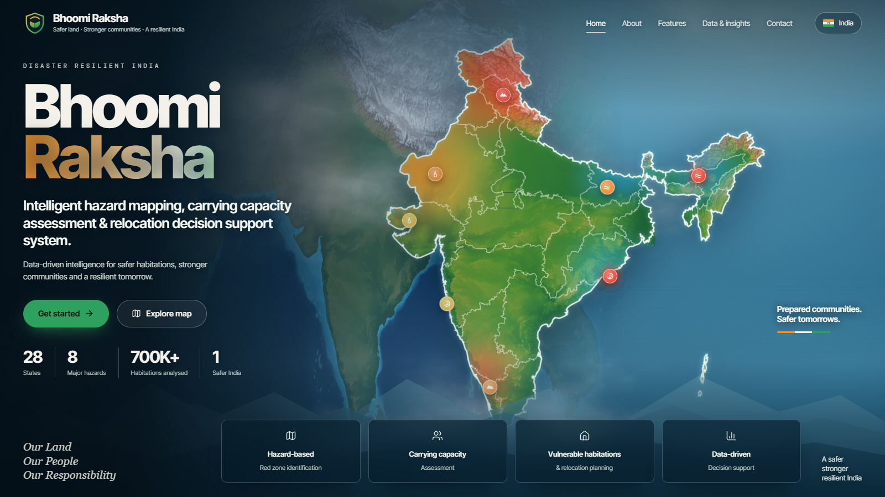

*A cinematic entry moves from the Earth to India to Kangra district, then hands off to the Command Center shown at the top of this page.*

The Command Center status strip reports the pilot's baseline directly from the API: **0 critical, 69 high landslide risk settlements, 12.8K exposed residents**. Settlement markers carry their landslide risk index; the caption reads *Susceptibility index · Unvalidated* alongside the model version. Layers without a real data source (historical events, rainfall, roads, hospitals, capacity) are marked **offline** rather than faked.

> The landing page frames the national vision for the product. Its headline figures are presentation copy, not outputs of the Kangra pilot.

### 02 — Habitation Risk Intelligence

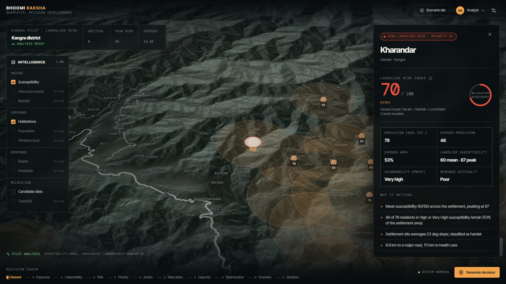

*Identify and prioritize vulnerable habitations using a transparent composite landslide risk index.*

"Investigate priority habitation" flies the camera to the district's priority #1 settlement, **Kharandar**: landslide risk index **70 / 100 (HIGH)**, a GHSL population estimate of 79, of whom 46 live in High or Very High susceptibility terrain. Every "why it matters" line is generated from measured inputs.

### 03 — Explainable Risk

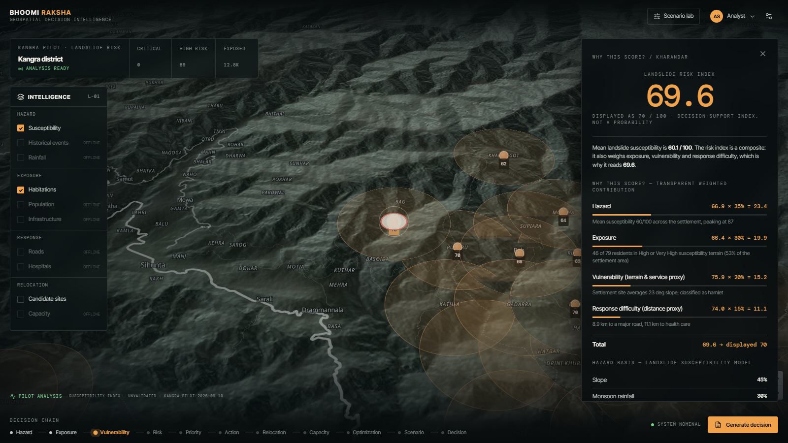

*Decompose risk into hazard, exposure, vulnerability and response difficulty.*

The WHY view shows each component score, its weight and its exact contribution — `66.9 × 35% = 23.4` — summing to **69.6, displayed as 70**. It also shows the hazard basis (slope 45%, monsoon rainfall 30%, local relief 25%) and explains why the risk index differs from raw susceptibility.

### 04 — Relocation Intelligence

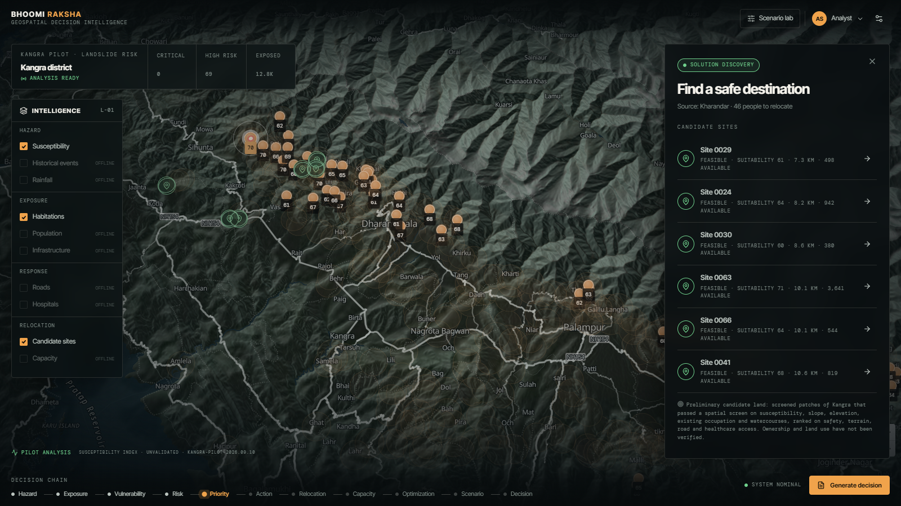

*Move from identifying vulnerable populations to evaluating screened alternative sites.*

Hazard layers recede and screened candidate areas appear, nearest first, each with screening status, suitability, distance and available capacity. The panel states plainly that these are **preliminary candidate land** — ownership and land use have not been verified.

### 05 — Carrying Capacity

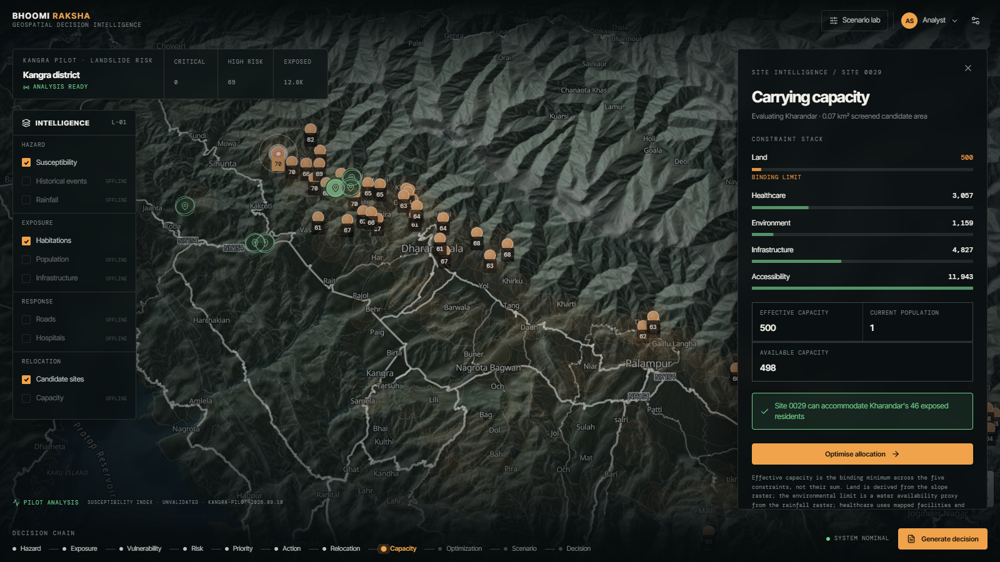

*Evaluate whether a candidate destination can accommodate additional population.*

Site 0029's constraint stack: land **500** (binding), environmental 1,159, healthcare 3,057, infrastructure 4,827, accessibility 11,943. Effective capacity is the minimum, not the sum: 500 − 1 existing resident = **498 available**, enough for Kharandar's 46 exposed residents.

### 06 — Relocation Optimization

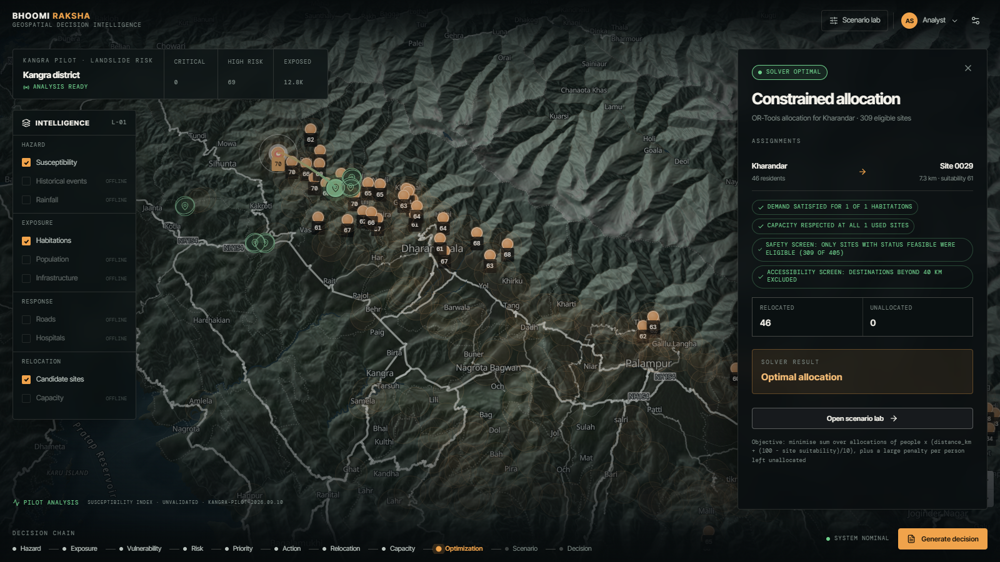

*Allocate exposed population across feasible destinations under capacity and planning constraints.*

The backend solves a mixed-integer program over 309 eligible sites. The UI reports the solver's own status (**OPTIMAL**), the assignment, relocated vs unallocated population, every constraint that was enforced and the objective function in words.

### 07 — Scenario Lab

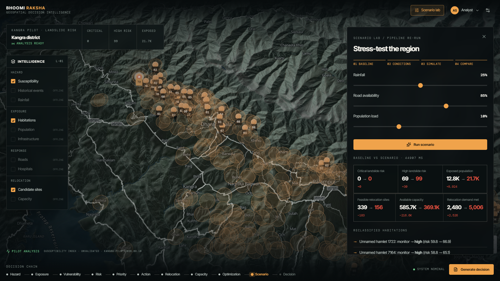

*Stress-test the decision pipeline under changing rainfall, road availability and population conditions.*

Rainfall +25%, road availability 85%, population +10%: high landslide risk settlements **69 → 99**, exposed population **12.8K → 21.7K**, feasible sites **339 → 156**, available capacity **585.7K → 369.1K**, relocation demand met **2,480 → 5,006**. The status strip and map markers update from the same response.

### 08 — Executive Decision Brief

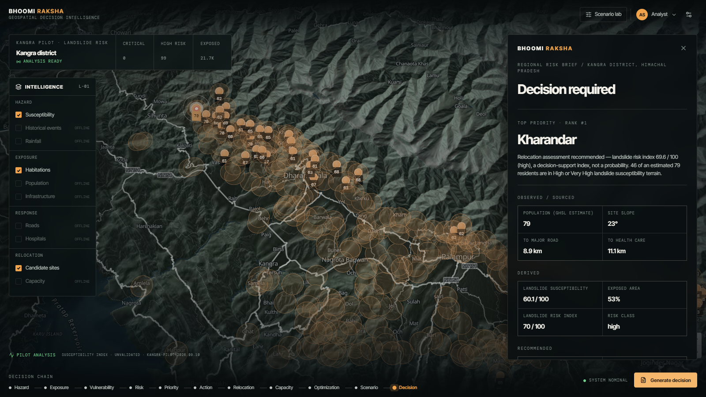

*Convert analytical outputs into an auditable decision-support summary.*

The brief separates **observed / sourced** inputs from **derived** results and **recommended** actions (preferred site, available capacity, binding constraint, relocation demand, solver result). It closes with a data-confidence grade, the reasons behind it, the disclaimer and the model version.

---

## Technical Architecture

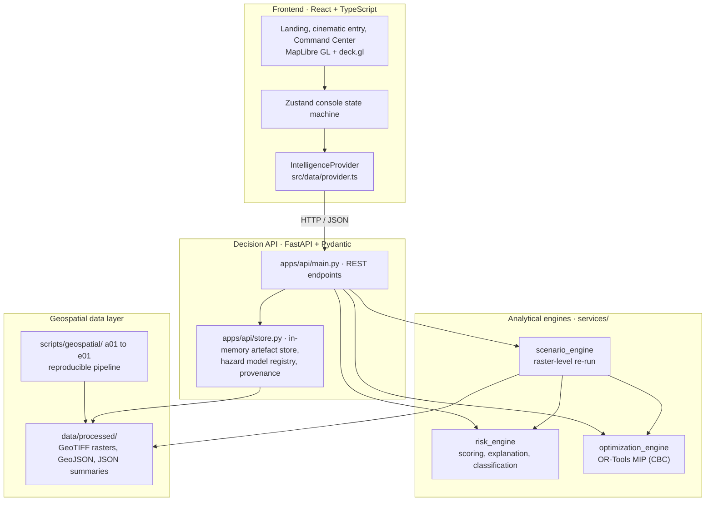

**Design principles, as implemented:**

- **The frontend does not own analytical truth.** The browser never reads a raster and never computes a risk, capacity or allocation value. Every analytical number arrives through `IntelligenceProvider` → FastAPI.
- **The API owns decision outputs.** Responses carry `hazard_type`, the hazard model, derivation strings for every capacity constraint, provenance, limitations and a disclaimer — so labels are built from data, not hard-coded.
- **Optimization runs on the backend.** OR-Tools is called server-side for single-habitation, district-wide and scenario allocations.
- **Scenarios propagate, they do not adjust.** The scenario engine recomputes the susceptibility raster and every downstream stage in-process.
- **Honest failure mode.** If the API is unreachable, the console falls back to `src/data/mock.ts` and displays a red **DEVELOPMENT FIXTURE** banner, so hand-authored numbers can never pass as analysis. The basemap is composed from local assets first (Blue Marble tiles, a pilot hillshade) and only enriched by a remote vector style when reachable.
- **Data layer.** The current pilot serves file-based artefacts (GeoTIFF, GeoJSON, JSON) loaded once into memory. There is no database in this build; the processed layers are structured so they could be moved into a spatial database without changing the API contract.

---

## Geospatial Intelligence Pipeline

Fifteen ordered, re-runnable scripts in [`scripts/geospatial/`](scripts/geospatial/) turn raw open data into analytical layers. Downloads are cached under `data/raw/`.

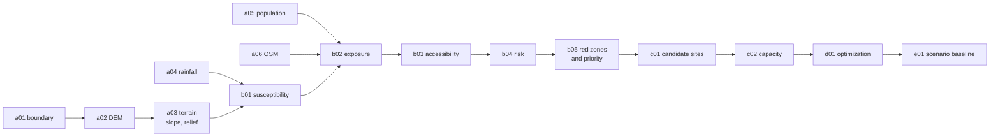

| Stage | Method |
|---|---|
| **Analysis grid** | EPSG:32643 (UTM 43N), 30 m, 4,651 × 2,925 — **6,338,007 in-district cells, 5,704 km²** |
| **DEM** (`a02`, `a03`) | AWS Terrain Tiles (zoom 12, SRTM-derived) mosaicked, reprojected with bilinear resampling, values outside 100–7,000 m masked, clipped to the district. Max elevation 5,981 m (Hanuman Tibba: 5,982 m) |
| **Terrain derivatives** (`a03`) | Slope by the **Horn (1981)** 3×3 method, computed in a projected CRS on the unclipped grid so edge cells keep valid neighbours. Local relief = 5×5 max − min. Median slope 11.2°, 18.9% of the district above 30° |
| **Rainfall** (`a04`) | WorldClim 2.1 June–September sum, bilinear-resampled to 30 m (range 215–1,983 mm) |
| **Population** (`a05`) | GHSL GHS-POP 100 m (Mollweide) converted to density, reprojected, multiplied back by cell area — **total-preserving** (district total 1,652,806) |
| **Settlements, roads, health** (`a06`) | OpenStreetMap via Overpass: 1,183 place nodes, 5,557 road segments (5,959 km), 209 health facilities |
| **Exposure** (`b02`) | Footprints rasterised to the grid; overlapping footprints resolved by a **deterministic Voronoi partition clipped to footprints** (nearest settlement centre wins). Zonal statistics via `numpy.bincount` |
| **Accessibility** (`b03`) | Euclidean distance to nearest road, major road (trunk/primary/secondary) and health facility; mean site slope |
| **Red zones** (`b05`) | Susceptibility ≥ 60 → mask → polygonised → patches < 0.05 km² dropped → simplified at one cell |
| **Candidate discovery** (`c01`) | Raster exclusion screen → 8-connected component labelling (`scipy.ndimage`) → patches ≥ 5 ha → EDT distance surfaces → suitability scoring |
| **QA and traceability** | `qa01_dem.py` separates boundary overhang from true interior voids (0 true voids); `verify_trace.py` re-derives any settlement's record directly from the rasters |

---

## Explainable Risk Intelligence

Bhoomi Raksha keeps five concepts separate, because collapsing them is how risk maps mislead:

| Concept | Question | Built from |
|---|---|---|
| **Hazard** | How predisposed is the terrain to landsliding? | Landslide susceptibility over the settlement footprint |
| **Exposure** | How much of the settlement, and how many people, are in hazardous terrain? | Exposed area share and GHSL population in cells with susceptibility ≥ 60 |
| **Vulnerability** *(proxy)* | How badly would the site fare? | Mean site slope and settlement class — a **terrain-and-service proxy, not social vulnerability** |
| **Response difficulty** *(proxy)* | How hard is the settlement to reach? | Straight-line distance to major road, health facility and nearest road |
| **Risk** | Which settlements need attention? | Weighted composite of the four above |

### Step 1 — Landslide susceptibility (30 m surface)

A transparent weighted overlay of three normalised factors:

| Factor | Weight | Normalisation |
|---|---:|---|
| Slope | **45%** | Piecewise, peaks at 35–45°, **declines above ~55°** (very steep faces are typically bare rock with little material left to fail) |
| Monsoon rainfall | **30%** | Linear, 200–2,000 mm |
| Local relief | **25%** | Linear, 0–200 m, saturating |

Classified as Very Low (0–20) · Low (20–40) · Moderate (40–60) · High (60–80, 868 km²) · Very High (80–100, 73 km²).

### Step 2 — Composite landslide risk index (per settlement)

```
hazard        = 0.75 × mean susceptibility + 0.25 × peak susceptibility
exposure      = 0.5 × exposed area % (0–60, linear) + 0.5 × exposed population (log-scaled, cap 5,000)
vulnerability = 0.6 × site-slope response + 0.4 × settlement-class service penalty
response      = 0.45 × major-road distance + 0.35 × health distance + 0.20 × local-road distance

risk = 0.35 × hazard + 0.30 × exposure + 0.20 × vulnerability + 0.15 × response
```

| Component | Weight |
|---|---:|
| Hazard | **35%** |
| Exposure | **30%** |
| Vulnerability (proxy) | **20%** |
| Response difficulty (proxy) | **15%** |

Classification: **critical ≥ 75 · high 60–75 · monitor 40–60 · safe < 40**.

> **These are transparent decision-model weights, not learned parameters and not probabilities.** They are documented expert judgement. The result is a **0–100 decision-support index, not the probability of a landslide occurring**. No machine-learning model is involved.

### Step 3 — Priority

Risk asks *how dangerous*. Priority asks *where to act first*:

```
priority = 0.45 × risk + 0.35 × exposed population (log-scaled) + 0.20 × response difficulty
```

That is why the district's highest-*risk* settlement (Jadhar, 72.8) ranks #3 by *priority*, behind Kharandar and Lower Bara Bhanghal.

### Explanation method — transparent weighted contribution

Each contribution is exactly `component score × weight`, and the four contributions sum to the risk score. This is an arithmetic decomposition of a linear model: auditable, reproducible and exact. It is **not SHAP** and is never labelled as SHAP or as AI explainability.

---

## Example Decision Trace — Kharandar

Kharandar, a hamlet in Kangra, is the district's **priority #1** settlement at baseline. Every value below is served by `/api/habitations/osm-7908530709` and re-derived from the rasters by `verify_trace.py` (result: *all traceable*).

| Measure | Value |
|---|---:|
| Population (GHSL estimate) | 79 |
| Exposed population (susceptibility ≥ 60) | 46 |
| Exposed area | 52.6% |
| Mean landslide susceptibility | 60.1 |
| Peak landslide susceptibility | 87.3 |
| Hazard component (0.75 × 60.1 + 0.25 × 87.3) | 66.9 |
| **Landslide risk index** | **69.6 → displayed 70 / 100** |
| Risk class | **HIGH** |
| Data confidence | MEDIUM (buffer-approximated footprint, straight-line access, unvalidated hazard layer) |

**Transparent weighted contribution:**

| Component | Score | × Weight | = Contribution | Evidence |
|---|---:|---:|---:|---|
| Hazard | 66.9 | 35% | **23.4** | Mean susceptibility 60, peaking at 87 |
| Exposure | 66.4 | 30% | **19.9** | 46 of 79 residents in High/Very High terrain (53% of area) |
| Vulnerability (proxy) | 75.9 | 20% | **15.2** | 23° mean site slope; hamlet |
| Response difficulty (proxy) | 74.0 | 15% | **11.1** | 8.9 km to a major road, 11.1 km to health care |
| **Total** | | | **69.6** | |

**Downstream of the score:** nearest screened site **Site 0029** (7.3 km, FEASIBLE, suitability 61) → land-bound effective capacity 500, available 498 → OR-Tools allocates all **46** residents, **0 unallocated**, status **OPTIMAL**.

Under Scenario Lab conditions of rainfall +50% and road availability 60%, Kharandar's index rises from 69.6 to **76.1** and it is reclassified **critical** — a computed transition, not a scripted one.

---

## Relocation Site Discovery

Candidate relocation areas are not drawn by hand. They are contiguous patches of the district that survive a raster exclusion screen:

| Screening step (30 m grid) | Cells | Area |
|---|---:|---:|
| District | 6,338,007 | 5,704 km² |
| Landslide susceptibility < 40 | 4,111,770 | 3,701 km² |
| Slope ≤ 15° | 3,759,505 | 3,384 km² |
| Elevation ≤ 2,200 m | 3,642,583 | 3,278 km² |
| Not inside an existing settlement allocation | 3,226,510 | 2,904 km² |
| 8-connected patches ≥ 5 ha | **405 candidate areas** | 2,869 km² |

**Preliminary suitability (0–100):**

| Dimension | Weight | Measure |
|---|---:|---|
| Safety | 40% | 100 − mean susceptibility |
| Terrain | 25% | Inverse mean slope, 0–15° |
| Road access | 20% | Inverse distance to any road, 0–3,000 m |
| Healthcare access | 15% | Inverse distance to a health facility, 0–15,000 m |

**Screening status:**

- **FEASIBLE** — suitability ≥ 60 **and** no cell in the patch reaches susceptibility 60 → **342 areas**
- **REVIEW** — suitability ≥ 45, or a hazardous fringe inside the patch → **63 areas**
- REJECTED — below that (none in the current output)

Sites offered to a habitation are sorted **nearest first, then by suitability**, so communities stay close to their land unless a nearer site is materially worse.

> These are **screened candidate areas**, not verified relocation land. The screen has no land-ownership, land-use, forest-cover or protected-area data, so the 2,869 km² total is an upper bound on what is genuinely available.

---

## Carrying Capacity Assessment

```
Effective capacity = MIN( land, infrastructure, healthcare, environmental, accessibility )
Available capacity = MAX( 0, effective capacity − current population )
Binding constraint = the constraint that produced the minimum
```

| Constraint | How it is computed | Provenance |
|---|---|---|
| **Land** | Developable hectares from the slope raster (≤ 10° counts fully, 10–15° counts half) × 100 persons/ha | DERIVED + curated density |
| **Environmental** | **Water availability proxy**: mean annual rainfall × area × runoff 0.15 ÷ (55 lpcd × 365). Not a measured water yield | DERIVED + curated runoff coefficient |
| **Healthcare** | OSM facilities within 10 km × IPHS hill norms (hospital 30,000, health centre 20,000, clinic/doctors 3,000) minus population already within 10 km | DERIVED |
| **Infrastructure** | Documented ceiling (12,000) scaled by measured distance to a major road | CURATED PILOT ASSUMPTION |
| **Accessibility** | Documented ceiling (15,000) scaled by measured distance to any road | CURATED PILOT ASSUMPTION |

**Binding constraints across all 405 candidates:** land 338 · healthcare 43 · infrastructure 24. Across the 342 FEASIBLE areas, total available capacity is 586,706 people, and 309 have spare capacity.

Every constraint is returned by the API with its derivation string and an `is_binding` flag, so the capacity stack in the UI is an auditable explanation rather than a single number.

> This is **modelled capacity**, not **verified operational capacity**. It indicates which resource is likely to limit a site first; it does not replace engineering, water-supply or health-department assessment.

---

## Constraint-Based Relocation Optimization

Relocation allocation is solved as a **mixed-integer program (MIP)** with **Google OR-Tools** (`pywraplp`, CBC backend) in [`services/optimization_engine/allocate.py`](services/optimization_engine/allocate.py).

**Decision variables**

```
x[i, j] ∈ ℤ≥0   people relocated from habitation i to candidate site j
u[i]    ∈ ℤ≥0   people from habitation i left unallocated (slack)
```

**Constraints**

| Constraint | Formulation |
|---|---|
| Demand | Σⱼ x[i,j] + u[i] = exposed population of i |
| Site capacity | Σᵢ x[i,j] ≤ available capacity of j |
| Safety / feasibility | x[i,j] exists only if site j is FEASIBLE (REVIEW sites optional via `allow_review_sites`) with spare capacity |
| Accessibility | x[i,j] exists only if the site is within `max_distance_km` (default 40 km, haversine) |
| Integrality | x, u are non-negative integers |

**Objective**

```
minimise  Σ x[i,j] · ( distance_km(i,j) + (100 − suitability_j) / 10 )  +  1000 · Σ u[i]
```

Two readable terms — how far people move and how good the destination is — plus a large penalty on unmet demand. The slack variable is deliberate: without it, one isolated habitation would make the whole model INFEASIBLE and the operator would learn nothing. With it, the solver still returns an optimal plan and reports exactly who could not be placed.

**District baseline** (all 67 high landslide risk settlements with exposed residents): solver **OPTIMAL**, 309 eligible sites, **2,480 people allocated** in 68 assignments to 21 sites, **0 unallocated**, distances 0.4–25.3 km.

The status shown in the interface is always the solver's own enum (`OPTIMAL`, `FEASIBLE`, `INFEASIBLE`, `NO_DEMAND`, …). "Optimal" is never asserted unless the solver returned it.

---

## Scenario Lab — Stress-Test the Decision

**Scenario Lab asks what happens when the operating conditions change.** It does not scale dashboard numbers — it re-runs the analytical chain in-process against the rasters:

```
rainfall / population / road availability
  → susceptibility raster, recomputed cell by cell
  → settlement exposure, re-accumulated over the allocation raster
  → risk and classification, risk engine re-run
  → priority, re-ranked
  → candidate site suitability and status, re-screened
  → carrying capacity, re-derived
  → OR-Tools allocation, re-solved
```

| Control | Range in UI | How it propagates |
|---|---|---|
| Rainfall | 0 to +50% | Scales the monsoon rainfall raster, a direct susceptibility input |
| Population load | 0 to +30% | Scales the GHSL population grid — exposure, risk and relocation demand |
| Road availability | 50–100% | Inflates effective distances (`× 100 / availability`), lowering road-access scores and the accessibility capacity ceiling. **A documented transformation, not a network model** |

Slope, relief, elevation and facility locations are fixed and do not respond. Each response lists these `propagation_notes` explicitly.

**Measured results** (from `/api/scenario/run`):

| Metric | Baseline | Rainfall +25%, population +10%, roads 85% | Rainfall +50%, roads 60% |
|---|---:|---:|---:|
| Critical landslide risk settlements | 0 | 0 | **6** |
| High landslide risk settlements | 69 | **99** | **112** |
| Exposed population | 12,780 | **21,704** | **21,703** |
| Feasible relocation sites | 339 | **156** | **33** |
| Available capacity (feasible sites) | 585,688 | **369,134** | **120,532** |
| Relocation demand met | 2,480 | **5,006** | **5,851** |
| Solver status | OPTIMAL | OPTIMAL | OPTIMAL |

> The Scenario Lab baseline (339 feasible sites) is a zero-delta run of the scenario engine itself, so both sides of every comparison come from one code path. It differs slightly from the stored pipeline screen (342) because the two aggregate candidate cells slightly differently at the screening boundary.

**The value is not in the slider. It is in propagating changed conditions through the decision pipeline** — more hazard raises exposure, which raises relocation demand, while the same change shrinks the pool of feasible destinations and their capacity. Scenario outputs are decision-support simulations under stated assumptions, not forecasts.

---

## Data & Provenance

| Dataset | Source | Resolution / coverage | Role | Licence / caveat |
|---|---|---|---|---|
| District boundary | GADM-derived open mirror (`geohacker/india`) | Generalised vector | Study area, clipping | **Not an official Survey of India boundary**; 5,704 km² vs published ~5,739 km² |
| Elevation | AWS Terrain Tiles (Mapzen), SRTM-derived | Zoom 12 (~26 m/px) → 30 m | Slope, relief, elevation screen | Surface model: includes canopy and buildings |
| Rainfall | WorldClim 2.1 monthly precipitation (Fick & Hijmans, 2017) | 2.5 arc-min (~4.6 km) → 30 m | Susceptibility trigger; water availability proxy | CC BY-SA 4.0; 1970–2000 climatology, not current season |
| Population | GHSL GHS-POP R2023A, epoch 2020 (EC JRC) | 100 m → 30 m, total-preserving | Exposure, relocation demand, capacity load | CC BY 4.0; **modelled estimate, not census** |
| Settlements, roads, health facilities | OpenStreetMap via Overpass API | Vector, contributor-dependent | Settlements, accessibility, healthcare capacity | **ODbL 1.0 — © OpenStreetMap contributors**; rural coverage uneven |
| Basemap imagery | NASA Blue Marble; OpenFreeMap style (display only) | Tiles | Visual context only | Never used as analytical input |

**Provenance classes used throughout the system:**

| Class | Examples in this pilot |
|---|---|
| **Observed / sourced** | SRTM-derived elevation, WorldClim rainfall, OSM places, roads and facilities |
| **Modelled input** | GHSL population estimate |
| **Derived** | Slope, relief, susceptibility, red zones, exposure, distances, suitability, land and healthcare capacity |
| **Modelling assumption** | Susceptibility and risk weights, class thresholds, footprint buffer radii (city 2,500 m … hamlet 250 m) |
| **Curated pilot assumption** | 100 persons/ha, runoff 0.15, infrastructure and accessibility ceilings — labelled `CURATED_PILOT_ASSUMPTION` in API responses |
| **Proxy** | Vulnerability (terrain and service), response difficulty (straight-line distance), environmental capacity (water availability proxy) |
| **Unavailable** | Landslide inventory, village-level Census 2011, SECC / socio-economic indicators, road-network routing, land ownership and land use, forest and protected areas, waterway layer |

Full detail: [`docs/data-sources.md`](docs/data-sources.md) · [`docs/data-inventory.md`](docs/data-inventory.md)

---

## Validation & Engineering Quality

| Check | File | What it asserts | Latest local run |
|---|---|---|---|
| Allocation order-independence | `tests/test_allocation_order.py` | Identical per-settlement cells and population across original, shuffled and reversed input order for all 1,183 settlements | Pass |
| Zero-delta equivalence | `tests/test_consistency.py` | A zero-delta scenario reproduces the stored pipeline's risk, hazard, population, exposure and class counts | Pass |
| Propagation direction | `tests/test_consistency.py` | Rainfall +40% never reduces exposure and never creates additional feasible sites | Pass |
| Hazard contract | `tests/test_hazard_contract.py` | Every score names its hazard (`landslide`); contributions sum to the score; metadata never moves a score; no unimplemented hazard is served | Pass (2 tests) |
| Cross-endpoint API contract | `tests/test_api_contract.py` *(needs the API on :8000)* | The same settlement carries identical numbers through exposure → risk → capacity → optimization → brief; zero-delta scenario is a no-op; solver status is a real enum; no SHAP labelling | Pass (3 tests) |
| Raster traceability | `scripts/geospatial/verify_trace.py <name>` | Re-derives hazard, exposed area, population, exposed population and slope from rasters and compares with the stored record | Kharandar: all traceable |
| DEM QA | `scripts/geospatial/qa01_dem.py` | Separates boundary overhang (3,380 cells) from true interior voids (0) | 0 in-district voids |
| Frontend type-check and build | `npm run build` (`tsc -b && vite build`) | Strict TypeScript compile and production bundle | Pass |
| End-to-end journey | — | The walkthrough screenshots were produced by driving the full journey (landing → brief) in headless Chrome against the live API | Completed |

8 automated tests across 4 files. No coverage percentage is reported because none is measured.

---

## Limitations & Responsible Use

Stated plainly, because a decision-support tool is only as credible as its disclosed limits.

- **The landslide susceptibility model is unvalidated.** No landslide inventory for Kangra was obtainable (NASA catalogue endpoints and ArcGIS services failed; the GSI inventory is not openly downloadable). The weights are literature-informed expert judgement. **There is no AUC, hit rate or accuracy figure** — the honest answer to "how accurate is it?" is *unknown*.
- **The landslide risk index is not a probability**, forecast or prediction of when or whether a slope will fail.
- **Population is a GHSL modelled estimate**, not a census count. District totals agree with Census 2011 trends; individual hamlets may not.
- **1,045 of 1,183 settlement footprints are class-based circular buffers**; only 138 use mapped OSM polygons. Each record carries `footprint_source`.
- **Vulnerability is a terrain-and-service proxy**, not social vulnerability.
- **Accessibility is straight-line distance**, not road-network travel time. Response difficulty is understated for the most remote settlements.
- **Rainfall is a ~4.6 km climatology**; resampling to 30 m interpolates rather than adding detail.
- **OSM health and rural road coverage is incomplete**, so distance-to-care is a lower bound on remoteness.
- **Two capacity ceilings are curated pilot assumptions** (infrastructure, accessibility); the environmental limit is a water availability proxy.
- **Land ownership, legal land use, forest cover and protected areas are not verified.** The watercourse exclusion is implemented but inactive, because no waterway layer is present in the processed data.
- **Road availability in scenarios inflates distances**; it does not remove network links.
- **The optimizer minimises distance and site quality only** — not construction cost, land acquisition, livelihoods or community preference.
- **Red-zone polygons are computed and served by the API**; the current console visualises settlement-level hazard fields and markers rather than drawing the polygons.
- **No settlement is critical at baseline** (highest index 72.8). Thresholds were not tuned to manufacture a critical case.

> **Final relocation decisions remain with authorized authorities and require field verification, legal review, community consultation and operational assessment.** Bhoomi Raksha supports human-in-the-loop decision making; it does not issue relocation orders.

Full detail: [`docs/limitations.md`](docs/limitations.md)

---

## Scalability & Multi-Hazard Architecture

| | Current pilot | Target architecture |
|---|---|---|
| Geography | Kangra district, Himachal Pradesh | India, processed per area of interest |
| Hazard | Landslide (operational) | Hazard-specific models registered one at a time |
| Data | File-based processed artefacts, prepared offline | National indexed datasets, AOI-driven tile selection |
| Compute | In-process scenario re-run, single API | Same engine contracts, scaled per AOI |

The scalable pattern is the same chain the pilot already runs, applied per area of interest:

```
India → national indexed datasets → area of interest → relevant geospatial tiles
      → hazard-specific processing → settlement exposure → risk → relocation
      → capacity → optimization → scenario → brief
```

**Current pilot operationalizes landslide intelligence; the architecture is designed to accommodate hazard-specific models.** The API attaches `hazard_type` and a hazard model to every score, and the UI builds labels such as *Landslide risk index* from it. Earthquake, flood and cyclone exist only as names in the type system — none is registered in the API, and none may reuse the landslide formula. Each would need its own hazard layer (ground shaking, flood depth, wind field) and its own exposure and vulnerability terms before any score could be shown.

---

## Recommended Demo Flow

A three-minute path through the product, with the takeaway at each step:

| # | Step | Takeaway |
|---|---|---|
| 1 | **Landing → Get started** | The product is framed around hazard-based red zones, carrying capacity and relocation decision support. |
| 2 | **Globe → India → Kangra** | A continuous camera descent sets geographic context before any number appears. |
| 3 | **Command Center** | District-level landslide risk counts and exposed population come straight from the analytical API, labelled unvalidated. |
| 4 | **Investigate priority habitation → Kharandar** | The system ranks where to act first, not just where hazard is highest. |
| 5 | **Investigate why** | The score of 69.6 decomposes exactly into four weighted contributions — no black box. |
| 6 | **Assess relocation** | The narrative turns from threat to solution with screened candidate areas, nearest first. |
| 7 | **Select Site 0029** | Capacity is the binding minimum of five constraints — here land — not an optimistic sum. |
| 8 | **Optimise allocation** | A real MIP solver places all 46 residents and reports OPTIMAL with every constraint listed. |
| 9 | **Open Scenario Lab → Run scenario** | Heavier rain and weaker roads raise demand while shrinking feasible sites — computed, not animated. |
| 10 | **Generate decision** | Everything condenses into an auditable brief that separates observed, derived and recommended, with its own confidence grade. |

---

## Tech Stack

| Layer | Technologies |
|---|---|
| **Frontend** | React 19, TypeScript, Vite 7, Tailwind CSS 4, Framer Motion, Lucide |
| **Geospatial visualization** | MapLibre GL JS via `react-map-gl`, deck.gl (`ScatterplotLayer`, `ArcLayer`), Turf.js |
| **State** | Zustand console state machine (`regional → investigate → explain → relocation → capacity → optimization → scenario → executive`) |
| **Decision API** | FastAPI, Pydantic v2 schemas, Uvicorn, GZip and CORS middleware |
| **Geospatial data engineering** | GeoPandas, Rasterio, Shapely, pyproj, NumPy, SciPy (`ndimage`), Pillow |
| **Operations research** | Google OR-Tools linear solver (CBC mixed-integer programming) |
| **Testing** | pytest, FastAPI `TestClient`, raster traceability and DEM QA scripts |

---

## Project Structure

```
bhoomi_raksha/
├── apps/api/                  FastAPI decision layer
│   ├── main.py                REST endpoints
│   ├── schemas.py             Pydantic response and request models
│   └── store.py               artefact store, hazard model registry, provenance, capacity derivations
├── services/
│   ├── risk_engine/           scoring, normalization, classification, transparent weighted contribution
│   ├── optimization_engine/   OR-Tools MIP allocation
│   └── scenario_engine/       raster-level scenario propagation
├── scripts/
│   ├── geospatial/            a01–e01 pipeline, qa01_dem.py, verify_trace.py
│   └── *.py, *.mjs            basemap and landing asset generation (visual only)
├── data/
│   ├── raw/                   downloaded sources (git-ignored)
│   └── processed/             analytical rasters, GeoJSON and JSON summaries
├── src/
│   ├── landing/               landing page and India hero
│   ├── console/               Command Center, panels, basemap, entry sequence
│   ├── data/                  typed API client, IntelligenceProvider, hazard labels, development fixture
│   ├── store/                 Zustand console store
│   ├── motion/                animation primitives
│   └── styles/
├── public/geo/                display-only imagery (Blue Marble tiles, relief renders)
├── tests/                     pytest suites
└── docs/
    ├── methodology.md         every formula and pipeline stage
    ├── data-sources.md        datasets, licences, processing, validation
    ├── data-inventory.md      real vs synthetic vs visual-only assets
    ├── limitations.md         what the system does not know
    └── screenshots/           README images
```

---

## Getting Started

### Prerequisites

- Python 3.10+
- Node.js 20.19+ (required by Vite 7)

### 1. Install dependencies

```bash
pip install geopandas rasterio shapely pyproj numpy scipy pillow ortools fastapi "uvicorn[standard]" pytest httpx
npm install
```

### 2. Prepare the analytical data

The processed GeoJSON and JSON artefacts in `data/processed/` are enough for the API to serve the region, settlements, risk explanations, candidate sites, capacity, optimization and executive briefs.

Rasters (`data/processed/*.tif`) and raw downloads (`data/raw/`) are excluded by `.gitignore`. **Scenario Lab, the consistency tests and the traceability scripts need the rasters**, so on a fresh clone run the pipeline once from the repository root. Download steps need internet access and are cached afterwards.

```bash
python scripts/geospatial/a01_boundary.py         # Kangra district boundary
python scripts/geospatial/a02_dem.py              # AWS Terrain Tiles, zoom 12
python scripts/geospatial/a03_terrain.py          # reproject, clip, slope, relief
python scripts/geospatial/a04_rainfall.py         # WorldClim monsoon climatology
python scripts/geospatial/a05_population.py       # GHSL 100 m population
python scripts/geospatial/a06_osm.py              # settlements, roads, health facilities
python scripts/geospatial/b01_susceptibility.py   # susceptibility index and classes
python scripts/geospatial/b02_exposure.py         # deterministic allocation and exposure
python scripts/geospatial/b03_accessibility.py    # site slope, road and health distance
python scripts/geospatial/b04_risk.py             # risk engine over all settlements
python scripts/geospatial/b05_redzones_priority.py
python scripts/geospatial/c01_candidate_sites.py  # candidate discovery and screening
python scripts/geospatial/c02_capacity.py         # carrying capacity
python scripts/geospatial/d01_optimization.py     # baseline OR-Tools allocation
python scripts/geospatial/e01_scenario.py         # scenario baseline bundle
python scripts/geospatial/qa01_dem.py             # DEM quality assurance
```

### 3. Run — two terminals, both from the repository root

```bash
# Terminal 1 — analytical API
python -m uvicorn apps.api.main:app --port 8000
```

```bash
# Terminal 2 — frontend
npm run dev        # http://localhost:5173
```

Set `VITE_API_BASE` to point the frontend at a different API host. If the API is unreachable, the console runs on the development fixture and says so with a **DEVELOPMENT FIXTURE** banner.

### 4. Test

```bash
python -m pytest tests/test_hazard_contract.py tests/test_consistency.py tests/test_allocation_order.py
python tests/test_api_contract.py                           # with the API running on :8000
python scripts/geospatial/verify_trace.py "Kharandar"
npm run build
```

---

## API Reference

Interactive OpenAPI documentation is served at `http://localhost:8000/docs`.

| Method | Endpoint | Returns |
|---|---|---|
| GET | `/api/health` | Status, model version, loaded counts |
| GET | `/api/region` | District summary, hazard model, class counts, exposure, provenance, disclaimer |
| GET | `/api/habitations?limit=&level=` | Settlement summaries in priority order |
| GET | `/api/priority?limit=` | Top-priority settlements |
| GET | `/api/habitations/{id}` · `/api/risk/{id}` | Full risk detail, components, contributions, evidence, data quality |
| GET | `/api/exposure/{id}` | Exposure record and method |
| GET | `/api/hazard/red-zones?min_area_km2=` | Red-zone polygons (GeoJSON) |
| GET | `/api/hazard/susceptibility` | Susceptibility model, weights, classes, validation status |
| GET | `/api/relocation/sites?habitation_id=&limit=&status=` | Screened candidate sites with capacity constraints |
| GET | `/api/capacity/{site_id}?habitation_id=` | Capacity stack with derivations and binding flag |
| POST | `/api/optimization/run` | OR-Tools allocation (`habitation_ids`, `max_distance_km`, `allow_review_sites`) |
| POST | `/api/scenario/run` | Baseline vs scenario deltas, reclassified settlements, re-solved allocation, propagation notes |
| GET | `/api/executive-brief/{id}` | Observed / derived / recommended decision brief |

---

## Research & Methodology

- [`docs/methodology.md`](docs/methodology.md) — pipeline, susceptibility normalisation, exposure allocation, risk, priority, screening, capacity, optimization and scenario formulations
- [`docs/data-sources.md`](docs/data-sources.md) — every dataset with licence, resolution, processing and validation
- [`docs/data-inventory.md`](docs/data-inventory.md) — which assets are real, synthetic or visual-only
- [`docs/limitations.md`](docs/limitations.md) — what the system does not know

**Methodological references used in the code:** Horn (1981) slope algorithm · Fick & Hijmans (2017) WorldClim 2 · GHSL GHS-POP R2023A · Indian Public Health Standards (IPHS) service norms · Jal Jeevan Mission 55 lpcd rural water norm.

---

## Attribution

- Elevation: AWS Terrain Tiles (Mapzen), SRTM-derived
- Rainfall: WorldClim 2.1 — Fick, S.E. & Hijmans, R.J. (2017), CC BY-SA 4.0
- Population: GHSL GHS-POP R2023A, European Commission Joint Research Centre, CC BY 4.0
- Settlements, roads, health facilities: **© OpenStreetMap contributors**, ODbL 1.0
- Earth imagery: NASA Visible Earth, Blue Marble (public domain)
- District boundary: GADM-derived open mirror — not an official Survey of India boundary
